# Package Update Skill

A .NET 10 tool that analyzes NuGet package upgrades between two versions, fetches release notes from GitHub, and generates a GitHub Copilot skill with migration instructions, breakdown docs, and Roslyn-based code transformation scripts.

## What It Does

Given a NuGet package name and two version numbers, this tool runs a 5-phase AI pipeline:

1. **Discovery** — Finds the package's source repository on GitHub and lists all release tags between the two versions
2. **Analyze** — Fetches and analyzes release notes for each version in chunks, extracting breaking changes, renames, and deprecations
3. **Compile** — Merges and deduplicates findings into a unified migration guide
4. **Generate** — Produces a SKILL.md, focused breakdown markdown docs, and a Roslyn migration script
5. **Review** — Cross-references all output against source evidence, fixes hallucinations or missing items

## Output

The tool writes a complete Copilot skill to `.copilot/skills/<package>-migration/` in the target repository:

```
.copilot/skills/microsoft-agents-ai-openai-migration/
├── SKILL.md                  # Main skill file with YAML frontmatter
├── breaking-changes.md       # Detailed breaking changes with code examples
├── api-renames.md            # Type, method, and namespace renames
├── dependency-changes.md     # Package reference updates
├── new-features.md           # New APIs and patterns to adopt
├── deprecations.md           # Deprecated APIs and replacements
└── scripts/
    └── migrate.csx           # Roslyn-based automated migration script
```

Working/validation artifacts are written to `output/<package>/validation/` (gitignored).

## Prerequisites

- [.NET 10 SDK](https://dotnet.microsoft.com/en-us/download/dotnet/10.0)
- A GitHub Copilot subscription (used via the [GitHub Copilot SDK](https://github.com/github/awesome-copilot/blob/main/cookbook/copilot-sdk/dotnet/README.md))
- [`dotnet-script`](https://github.com/dotnet-script/dotnet-script) (to run the generated migration scripts)

```bash
dotnet tool install -g dotnet-script
```

## Installation

### Install as a .NET tool (requires .NET 10 runtime)

```bash
dnx PackageUpdateSkill
```

Or install manually:

```bash
dotnet pack PackageUpdateSkill
dotnet tool install --global --add-source ./PackageUpdateSkill/nupkg PackageUpdateSkill
```

### Download native binary (no runtime required)

Pre-built AOT native binaries are attached to each [GitHub Release](https://github.com/seiggy/package-update-skill/releases) for:

| Platform | Asset |
|----------|-------|
| Linux x64 | `package-update-skill-linux-x64.tar.gz` |
| Linux ARM64 | `package-update-skill-linux-arm64.tar.gz` |
| macOS ARM64 (Apple Silicon) | `package-update-skill-osx-arm64.tar.gz` |
| Windows x64 | `package-update-skill-win-x64.zip` |
| Windows ARM64 | `package-update-skill-win-arm64.zip` |

Extract and place the binary on your `PATH`.

## Usage

```bash
package-update-skill <PackageName> <FromVersion> <ToVersion> [--model <model>] [--dir <repoDir>]
```

### Options

| Flag | Default | Description |
|------|---------|-------------|
| `--model <model>` | `gpt-5` | LLM model to use (e.g., `gpt-5`, `claude-opus-4.6`, `gpt-5.2-codex`) |
| `--dir <repoDir>` | Current directory | Repository root where `.copilot/skills/` will be created |
| `--paranoid` | Off | Scans external content for prompt injection attempts, adds defensive prompts, generates a security report |
| `--debug` | Off | Retains intermediate output/validation files after completion (normally cleaned up) |

### Environment Variables

| Variable | Required | Description |
|----------|----------|-------------|
| `GITHUB_TOKEN` | Optional | GitHub PAT — falls back to Copilot SDK auth |

### Examples

```bash
# Analyze a package upgrade and write the skill to the current repo
package-update-skill Microsoft.Agents.AI.OpenAI 1.0.0-preview.251007.1 1.0.0-preview.260209.1

# Use a specific model and target a different repo
package-update-skill Newtonsoft.Json 12.0.3 13.0.3 --model claude-opus-4.6 --dir /path/to/my-project

# Run via dnx without installing
dnx PackageUpdateSkill Microsoft.Agents.AI.OpenAI 1.0.0-preview.251007.1 1.0.0-preview.260209.1
```

## Architecture

```mermaid
flowchart LR
    D["🔍 Discovery\nNuGet README\nGitHub tags"]
    A["📝 Analyze\n(chunked)\nGitHub release notes"]
    C["🔗 Compile\nMerge &\ndeduplicate"]
    G["⚙️ Generate\nSKILL.md\nBreakdown docs\nmigrate.csx"]
    R["✅ Review\nCross-ref vs evidence\nFix issues"]

    D --> A --> C --> G --> R
```



Each phase runs as an isolated Copilot SDK session with only the tools it needs. The tool uses:

- **GitHub Copilot SDK** — LLM inference + built-in GitHub tools (repo search, releases, file contents)
- **NuGet MCP Server** (`dotnet tool exec NuGet.Mcp.Server`) — package metadata and README
- **Microsoft.CodeAnalysis.CSharp** (Roslyn) — powers the generated migration scripts

## Security

This tool ingests **untrusted external content** (NuGet READMEs, GitHub release notes) and feeds it to an LLM that generates executable code (`migrate.csx`). This creates a prompt injection attack surface.

### Two-Layer Validation

The `--paranoid` flag enables a defense-in-depth approach with two complementary validation layers:

**Layer 1: Regex Fast-Pass** (free, instant)
- Scans for 25+ known injection patterns: `ignore previous instructions`, `<|im_start|>`, `[SYSTEM]`, role hijacking markers, etc.
- Catches obvious, unobfuscated attacks immediately
- Zero latency cost — runs before any LLM calls

**Layer 2: LLM Semantic Analysis** (deep, thorough)
- Uses the Copilot SDK to run a dedicated security-analyst session
- Content is wrapped in `<untrusted>` tags and analyzed for 7 attack categories:
  1. **Direct Override** — attempts to change LLM role/instructions
  2. **Token Boundary** — fake control tokens (`<|im_start|>`, `[INST]`, `<<SYS>>`)
  3. **Role Hijacking** — identity assumption, safety removal
  4. **Obfuscated Attacks** — Unicode homoglyphs, zero-width chars, base64, ROT13, word splitting
  5. **Indirect Injection** — instructions targeting downstream LLM behavior
  6. **Data Exfiltration** — attempts to leak env vars, tokens, or send data to external URLs
  7. **Code Injection** — reverse shells, credential theft, process spawning disguised as migration code
- Validator sessions have **all tools denied** (pure text analysis, no file/network access)
- Separate `ValidateGeneratedScriptAsync` method specifically reviews `.csx` files for malicious code patterns

### Other Mitigations

- **Input validation** — Package names and versions are validated against strict patterns; path traversal is blocked
- **Content sandboxing** — External content is wrapped in `<untrusted-content>` delimiters with explicit instructions to the LLM to extract only factual data
- **Anti-injection prompts** — All phases include defensive language instructing the LLM to ignore embedded instructions
- **Review phase** — Phase 5 cross-references output against source evidence to catch hallucinations
- **Security report** — When `--paranoid` is used, a `security-report.md` is generated in the validation directory with all findings from both layers

### Best Practices

1. **Always review `migrate.csx` before running** — it executes arbitrary code on your machine
2. **Use `--paranoid` for unfamiliar packages** — especially community packages you haven't vetted
3. **Check PR links** — every change in the output should trace to a real GitHub PR
4. **Diff validation artifacts** — compare `validation/compiled-summary.md` against the generated skill
